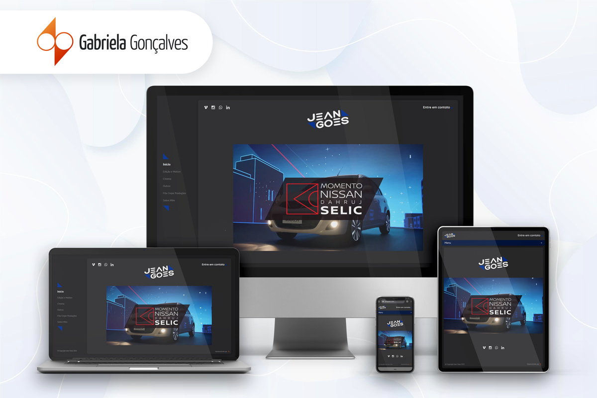

## Site Portfólio do Jean Goes

Em 2020, o Jean me contatou para ajudá-lo a construir um site que mostrasse o seu trabalho como editor, diretor e produtor de vídeos. Os desafios foram muitos já que esse foi meu primeiro site dinâmico e tive que aprender a trabalhar com gerenciadores de conteúdo. No fim, eu não poderia estar mais feliz com o resultado já que no final de 2020 o Jean conseguiu um novo emprego. 

Iniciei o projeto prototipando o site no Adobe XD e dei sequência no desenvolvimento utilizando o gerador de sites estáticos Hugo que foi integrado posteriormente com o CMS do Netlify, o que permitiu que a troca do conteúdo fosse dinâmica.

Você pode conferir o resultado no link [www.jeangoes.com](https://www.jeangoes.com/). 😉

